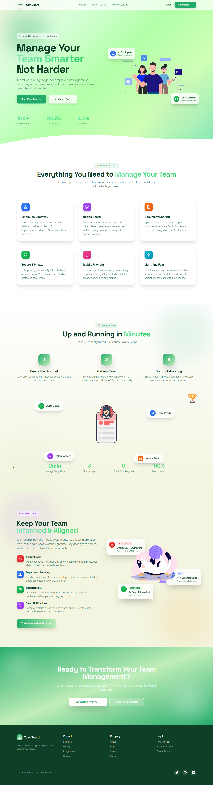
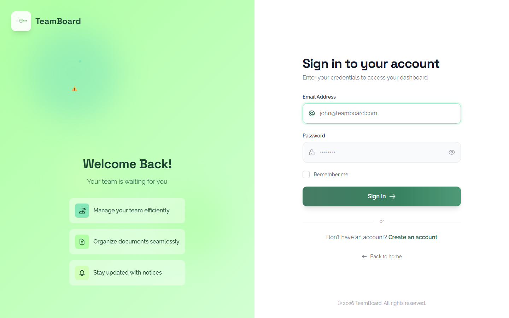
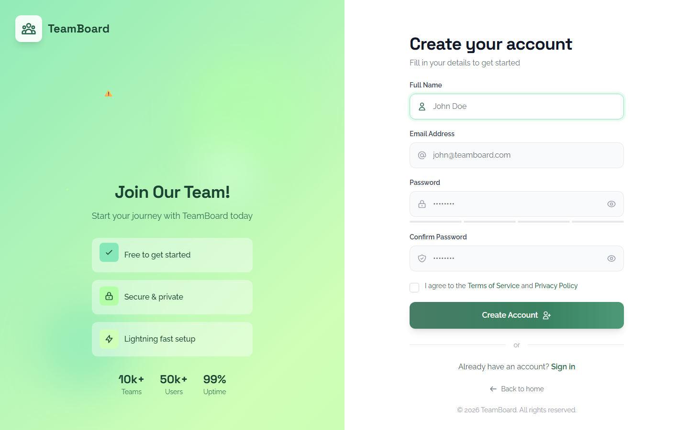
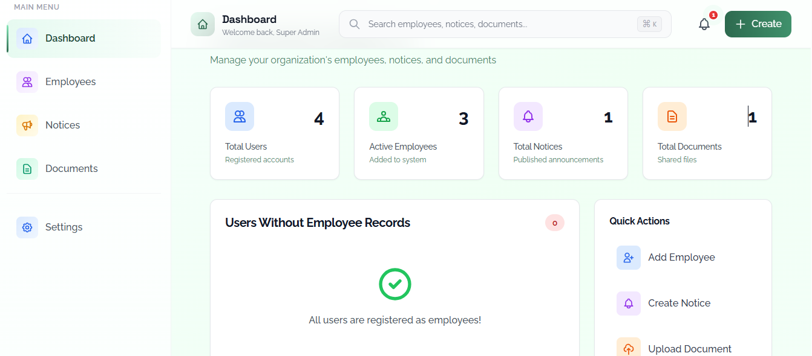

# 📋 TeamBoard

<div align="center">


**An internal team hub for employees, notices, documents, notifications, and feedback — built with Laravel**

[Features](#-features) • [Installation](#-installation) • [Architecture](#-architecture) • [Screenshots](#-screenshots)

</div>

---

## 📖 Table of Contents

- [Overview](#-overview)
- [Features](#-features)
- [Technology Stack](#-technology-stack)
- [System Requirements](#-system-requirements)
- [Installation](#-installation)
- [Database Schema](#-database-schema)
- [Architecture](#-architecture)
- [User Roles](#-user-roles)
- [API Endpoints](#-api-endpoints)
- [Security Features](#-security-features)
- [Testing](#-testing)
- [Deployment](#-deployment)
- [Contributing](#-contributing)
- [License](#-license)

---

## 🎯 Overview

**TeamBoard** is a comprehensive internal announcement and employee directory system designed for modern organizations. It provides a centralized platform for managing employee information, posting company-wide announcements, and sharing important documents.

### Key Highlights

- 🔐 **Secure Authentication** - Login/registration with protected routes
- 🧑‍💼 **Super Admin Dashboard** - Special dashboard for organization-wide oversight
- 👥 **Employee Directory** - Searchable employee records
- 📢 **Notice Board** - Priority-based announcements
- 📁 **Document Library** - Centralized file sharing (upload/download)
- 🔔 **Notifications** - Real, stored notifications with unread counts
- 💬 **Feedback on Content** - Acknowledge / Disagree / Concern (with attachment)
- ⚙️ **Settings** - Profile + password management
- 🎨 **Modern UI** - Tailwind CSS + Alpine.js

**Production:** https://teamboard.42web.io

---

## ✨ Features

### Phase 1: Foundation
- ✅ User authentication (Login/Logout)
- ✅ Role-based authorization (Admin/User)
- ✅ Dashboard with statistics
- ✅ Responsive navigation

### Phase 2: Employee Directory 
- ✅ Employee listing with pagination
- ✅ Advanced search functionality
- ✅ Department filtering
- ✅ Individual employee profiles
- ✅ Photo management

### Phase 3: Notice Board 
- ✅ Create, Read, Update, Delete notices
- ✅ Priority levels (Low, Medium, High)
- ✅ Author information display
- ✅ Search and filter capabilities

### Phase 4: Security & Testing
- ✅ CSRF protection
- ✅ Input validation
- ✅ Authorization policies
- ✅ Unit and feature tests

### Phase 5: Advanced Features
- ✅ Document sharing system (upload/download)
- ✅ Real notifications system (welcome, new notice, new document, employee added)
- ✅ Feedback on notices/documents (acknowledge/disagree/concern + optional attachment)
- ✅ Super-admin escalation (concerns notify super admin)
- ✅ Settings page (profile + password)

---

## 🛠 Technology Stack

```
Backend:
├── Laravel 11.x          # PHP Framework
├── PHP 8.2+              # Programming Language
└── MySQL 8.0             # Database

Frontend:
├── Tailwind CSS 3.4      # Utility-first CSS Framework
├── Alpine.js 3.x         # Lightweight JavaScript
└── Blade Templates       # Laravel Templating Engine

Development:
├── Vite                  # Asset Bundler
├── Composer              # PHP Dependency Manager
└── NPM                   # JavaScript Package Manager
```

---

## 💻 System Requirements

- **PHP**: 8.2 or higher
- **Composer**: 2.x
- **Node.js**: 18.x or higher
- **MySQL**: 8.0 or higher
- **Web Server**: Apache/Nginx

---

## 🚀 Installation

### 1. Clone the Repository

```bash
git clone https://github.com/yourusername/TeamBoard.git
cd TeamBoard
```

### 2. Install PHP Dependencies

```bash
composer install
```

### 3. Install JavaScript Dependencies

```bash
npm install
```

### 4. Environment Configuration

```bash
cp .env.example .env
php artisan key:generate
```

### 5. Configure Database

Edit `.env` file:

```env
DB_CONNECTION=mysql
DB_HOST=127.0.0.1
DB_PORT=3306
DB_DATABASE=teamboard
DB_USERNAME=root
DB_PASSWORD=your_password
```

### 6. Run Migrations

```bash
php artisan migrate
```

### 7. Seed Database (Optional)

```bash
php artisan db:seed
```

This creates:
- **Admin User**: admin@teamboard.com / password
- **Regular Users**: john@teamboard.com / password
- Sample employees, notices, and documents

### 8. Create Storage Link

```bash
php artisan storage:link
```

### 9. Build Assets

```bash
npm run dev
# Or for production
npm run build
```

### 10. Start Development Server

```bash
php artisan serve
```

Visit: `http://localhost:8000`

---

## 🗄 Database Schema

### Entity Relationship Diagram

```
┌─────────────────┐         ┌──────────────────┐
│     Users       │         │    Employees     │
├─────────────────┤         ├──────────────────┤
│ id (PK)         │         │ id (PK)          │
│ name            │         │ name             │
│ email (unique)  │         │ email (unique)   │
│ password        │         │ department       │
│ role            │         │ phone            │
│ created_at      │         │ photo            │
│ updated_at      │         │ bio              │
└────────┬────────┘         │ created_at       │
         │                  │ updated_at       │
         │                  └──────────────────┘
         │
         │ author_id (FK)
         ├───────────────────┐
         │                   │
┌────────▼────────┐  ┌───────▼──────────┐
│    Notices      │  │    Documents     │
├─────────────────┤  ├──────────────────┤
│ id (PK)         │  │ id (PK)          │
│ title           │  │ title            │
│ content         │  │ filename         │
│ author_id (FK)  │  │ filepath         │
│ priority        │  │ uploader_id (FK) │
│ created_at      │  │ created_at       │
│ updated_at      │  │ updated_at       │
└─────────────────┘  └──────────────────┘

┌──────────────────┐         ┌──────────────────┐
│  Notifications    │         │     Feedback     │
├──────────────────┤         ├──────────────────┤
│ id (PK)           │         │ id (PK)          │
│ user_id (FK)      │         │ user_id (FK)     │
│ type              │         │ feedbackable_*   │
│ title             │         │ type             │
│ message           │         │ message          │
│ icon              │         │ attachment       │
│ link              │         │ created_at       │
│ read              │         │ updated_at       │
│ created_at        │         └──────────────────┘
│ updated_at        │
└──────────────────┘
```

### Table Specifications

#### **users**
| Column | Type | Attributes |
|--------|------|------------|
| id | BIGINT | PRIMARY KEY, AUTO_INCREMENT |
| name | VARCHAR(255) | NOT NULL |
| email | VARCHAR(255) | UNIQUE, NOT NULL |
| password | VARCHAR(255) | NOT NULL |
| role | ENUM('admin','user') | DEFAULT 'user' |
| created_at | TIMESTAMP | |
| updated_at | TIMESTAMP | |

#### **employees**
| Column | Type | Attributes |
|--------|------|------------|
| id | BIGINT | PRIMARY KEY, AUTO_INCREMENT |
| name | VARCHAR(255) | NOT NULL |
| email | VARCHAR(255) | UNIQUE, NOT NULL |
| department | VARCHAR(255) | NOT NULL |
| phone | VARCHAR(255) | NULLABLE |
| photo | VARCHAR(255) | NULLABLE |
| bio | TEXT | NULLABLE |
| created_at | TIMESTAMP | |
| updated_at | TIMESTAMP | |

#### **notices**
| Column | Type | Attributes |
|--------|------|------------|
| id | BIGINT | PRIMARY KEY, AUTO_INCREMENT |
| title | VARCHAR(255) | NOT NULL |
| content | TEXT | NOT NULL |
| author_id | BIGINT | FOREIGN KEY → users.id |
| priority | ENUM('low','medium','high') | DEFAULT 'medium' |
| created_at | TIMESTAMP | |
| updated_at | TIMESTAMP | |

#### **documents**
| Column | Type | Attributes |
|--------|------|------------|
| id | BIGINT | PRIMARY KEY, AUTO_INCREMENT |
| title | VARCHAR(255) | NOT NULL |
| filename | VARCHAR(255) | NOT NULL |
| filepath | VARCHAR(255) | NOT NULL |
| uploader_id | BIGINT | FOREIGN KEY → users.id |
| created_at | TIMESTAMP | |
| updated_at | TIMESTAMP | |

#### **notifications**
| Column | Type | Attributes |
|--------|------|------------|
| id | BIGINT | PRIMARY KEY, AUTO_INCREMENT |
| user_id | BIGINT | FOREIGN KEY → users.id |
| type | VARCHAR(50) | NOT NULL |
| title | VARCHAR(255) | NOT NULL |
| message | TEXT | NOT NULL |
| icon | VARCHAR(50) | NULLABLE |
| link | VARCHAR(255) | NULLABLE |
| read | BOOLEAN | DEFAULT false |
| created_at | TIMESTAMP | |
| updated_at | TIMESTAMP | |

#### **feedback**
| Column | Type | Attributes |
|--------|------|------------|
| id | BIGINT | PRIMARY KEY, AUTO_INCREMENT |
| user_id | BIGINT | FOREIGN KEY → users.id |
| feedbackable_type | VARCHAR(255) | Morph type (Notice/Document) |
| feedbackable_id | BIGINT | Morph id |
| type | ENUM('acknowledge','disagree','concern') | NOT NULL |
| message | TEXT | NULLABLE |
| attachment | VARCHAR(255) | NULLABLE |
| created_at | TIMESTAMP | |
| updated_at | TIMESTAMP | |

---

## 🏗 Architecture

### Application Flow

```
┌──────────────┐
│   Browser    │
└──────┬───────┘
       │ HTTP Request
       ▼
┌──────────────────────────────┐
│      Web Server (Nginx)      │
└──────────────┬───────────────┘
               │
               ▼
┌──────────────────────────────┐
│      Laravel Application     │
├──────────────────────────────┤
│  ┌────────────────────────┐  │
│  │   Routes (web.php)     │  │
│  └───────────┬────────────┘  │
│              │                │
│  ┌───────────▼────────────┐  │
│  │    Controllers         │  │
│  │  • DashboardController │  │
│  │  • EmployeeController  │  │
│  │  • NoticeController    │  │
│  │  • DocumentController  │  │
│  └───────────┬────────────┘  │
│              │                │
│  ┌───────────▼────────────┐  │
│  │    Models (Eloquent)   │  │
│  │  • User                │  │
│  │  • Employee            │  │
│  │  • Notice              │  │
│  │  • Document            │  │
│  └───────────┬────────────┘  │
│              │                │
│  ┌───────────▼────────────┐  │
│  │    Policies            │  │
│  │  • Authorization       │  │
│  └───────────┬────────────┘  │
│              │                │
│  ┌───────────▼────────────┐  │
│  │   Blade Views          │  │
│  │  • Components          │  │
│  │  • Layouts             │  │
│  └────────────────────────┘  │
└───────────────┬──────────────┘
                │
                ▼
        ┌───────────────┐
        │  MySQL DB     │
        └───────────────┘
```

### MVC Pattern

```
Model (Eloquent ORM)
    ↓
Controller (Business Logic)
    ↓
View (Blade Templates)
```

### Directory Structure

```
TeamBoard/
├── app/
│   ├── Http/
│   │   └── Controllers/
│   │       ├── Auth/
│   │       │   └── LoginController.php
│   │       ├── DashboardController.php
│   │       ├── EmployeeController.php
│   │       ├── NoticeController.php
│   │       └── DocumentController.php
│   ├── Models/
│   │   ├── User.php
│   │   ├── Employee.php
│   │   ├── Notice.php
│   │   └── Document.php
│   └── Policies/
│       ├── EmployeePolicy.php
│       ├── NoticePolicy.php
│       └── DocumentPolicy.php
├── database/
│   ├── migrations/
│   └── seeders/
├── resources/
│   ├── css/
│   │   └── app.css
│   ├── js/
│   │   ├── app.js
│   │   └── bootstrap.js
│   └── views/
│       ├── auth/
│       ├── components/
│       ├── documents/
│       ├── employees/
│       ├── layouts/
│       └── notices/
├── routes/
│   └── web.php
├── public/
├── storage/
├── .env.example
├── composer.json
├── package.json
├── tailwind.config.js
└── vite.config.js
```

---

## 👥 User Roles

### Super Admin
- ✅ Uses the same login page as users
- ✅ Sees a dedicated super-admin dashboard
- ✅ Can review all feedback (especially concerns)
- ✅ Receives notifications when concerns are raised

### User
- ✅ Employee directory (browse/search)
- ✅ Notices (create + manage own; view all)
- ✅ Documents (upload, download; delete own)
- ✅ Feedback on notices/documents (acknowledge/disagree/concern)
- ✅ Notifications dropdown (real data + mark-as-read)
- ✅ Settings (profile + password)

---

## 🔌 API Endpoints

### Authentication
```
GET  /login               - Show login form
POST /login               - Authenticate user
POST /logout              - Logout user
```

### Dashboard
```
GET  /dashboard           - Main dashboard
```

### Employees
```
GET    /employees         - List all employees
GET    /employees/create  - Show create form (Admin)
POST   /employees         - Store new employee (Admin)
GET    /employees/{id}    - Show employee profile
GET    /employees/{id}/edit - Show edit form (Admin)
PUT    /employees/{id}    - Update employee (Admin)
DELETE /employees/{id}    - Delete employee (Admin)
```

### Notices
```
GET    /notices           - List all notices
GET    /notices/create    - Show create form
POST   /notices           - Store new notice
GET    /notices/{id}      - Show notice
GET    /notices/{id}/edit - Show edit form (Owner/Admin)
PUT    /notices/{id}      - Update notice (Owner/Admin)
DELETE /notices/{id}      - Delete notice (Owner/Admin)
```

### Documents
```
GET    /documents         - List all documents
GET    /documents/create  - Show upload form
POST   /documents         - Upload document
GET    /documents/{id}/download - Download document
DELETE /documents/{id}    - Delete document (Owner/Admin)
```

### Notifications
```
GET  /notifications                 - List notifications
POST /notifications/{id}/read       - Mark one as read
POST /notifications/mark-all-read   - Mark all as read
```

### Feedback
```
POST /feedback                      - Submit feedback (acknowledge/disagree/concern)
GET  /feedback                      - Super admin feedback overview
```

### Settings
```
GET  /settings                      - Settings page
POST /settings/profile              - Update profile
POST /settings/password             - Update password
```

---

## 🔒 Security Features

### Built-in Protection

1. **CSRF Protection**
   - All forms include CSRF tokens
   - Automatic validation on POST/PUT/DELETE requests

2. **SQL Injection Prevention**
   - Eloquent ORM with prepared statements
   - Input sanitization

3. **XSS Protection**
   - Blade template auto-escaping
   - HTML purification

4. **Authentication**
   - Secure password hashing (bcrypt)
   - Session management
   - Remember me functionality

5. **Authorization**
   - Policy-based access control
   - Role-based permissions
   - Route middleware protection

6. **File Upload Security**
   - MIME type validation
   - File size limits
   - Secure storage

### Configuration

```php
// config/auth.php
'guards' => [
    'web' => [
        'driver' => 'session',
        'provider' => 'users',
    ],
],

// Middleware in routes/web.php
Route::middleware('auth')->group(function () {
    // Protected routes
});
```

---

## 🧪 Testing

### Run Tests

```bash
# Run all tests
php artisan test

# Run specific test suite
php artisan test --testsuite=Feature

# Run with coverage
php artisan test --coverage
```

### Test Structure

```
tests/
├── Feature/
│   └── AuthenticationTest.php
└── TestCase.php
```

---

## 🚀 Deployment

### Production Checklist

- [ ] Set `APP_ENV=production` in `.env`
- [ ] Set `APP_DEBUG=false`
- [ ] Set `APP_URL=https://teamboard.42web.io`
- [ ] Configure production database
- [ ] Run `php artisan config:cache`
- [ ] Run `php artisan route:cache`
- [ ] Run `php artisan view:cache`
- [ ] Run `npm run build`
- [ ] Set proper file permissions
- [ ] Configure web server
- [ ] Enable HTTPS
- [ ] Set up backups

### Shared Hosting (Important)

- Remove the Vite dev-server indicator file: delete `public/hot` (and ensure it does not exist in production).
- Upload built assets: upload `public/build/` to your production web root (same level as `index.php`).
- Upload static assets: upload `public/assets/` to your production web root.

### Server Configuration

#### Nginx Example

```nginx
server {
    listen 80;
    server_name teamboard.42web.io;
    root /var/www/TeamBoard/public;

    add_header X-Frame-Options "SAMEORIGIN";
    add_header X-Content-Type-Options "nosniff";

    index index.php;

    charset utf-8;

    location / {
        try_files $uri $uri/ /index.php?$query_string;
    }

    location = /favicon.ico { access_log off; log_not_found off; }
    location = /robots.txt  { access_log off; log_not_found off; }

    error_page 404 /index.php;

    location ~ \.php$ {
        fastcgi_pass unix:/var/run/php/php8.2-fpm.sock;
        fastcgi_param SCRIPT_FILENAME $realpath_root$fastcgi_script_name;
        include fastcgi_params;
    }

    location ~ /\.(?!well-known).* {
        deny all;
    }
}
```

---

## 📸 Screenshots

Add your screenshots into `docs/screenshots/` using these filenames (then they will render below):

### Landing


### Login


### Register


### Dashboard


### Super Admin Dashboard


### Notices + Feedback


### Documents + Feedback


### Notifications


### Settings


### Feedback (Admin Overview)


---

## 🎨 Design System

### Color Palette

```css
/* CSS Variables */
:root {
  --primary: 221.2 83.2% 53.3%;           /* Blue */
  --secondary: 210 40% 96.1%;             /* Light Gray */
  --destructive: 0 84.2% 60.2%;           /* Red */
  --muted: 210 40% 96.1%;                 /* Muted Gray */
  --accent: 210 40% 96.1%;                /* Accent */
  --border: 214.3 31.8% 91.4%;            /* Border */
  --radius: 0.5rem;                       /* Border Radius */
}
```

### Typography

- **Font Family**: Raleway + Space Grotesk (Google Fonts)

### Components

- **Card**: Rounded corners (0.75rem), subtle shadow
- **Button**: Multiple variants (default, outline, ghost, destructive)
- **Table**: Hover effects, alternating rows
- **Forms**: Consistent styling, validation feedback

---

## 📚 Documentation

### Default Credentials

```
Admin Account:
Email: admin@teamboard.com
Password: password

User Account:
Email: john@teamboard.com
Password: password
```

### Common Commands

```bash
# Clear all caches
php artisan optimize:clear

# Create new migration
php artisan make:migration create_table_name

# Create new model
php artisan make:model ModelName -mcr

# Create new controller
php artisan make:controller ControllerName

# Create new policy
php artisan make:policy PolicyName --model=ModelName
```

---

## 🤝 Contributing

Contributions are welcome! Please follow these steps:

1. Fork the repository
2. Create a feature branch (`git checkout -b feature/AmazingFeature`)
3. Commit your changes (`git commit -m 'Add some AmazingFeature'`)
4. Push to the branch (`git push origin feature/AmazingFeature`)
5. Open a Pull Request

---

## 📄 License

This project is licensed under the MIT License - see the [LICENSE](LICENSE) file for details.

---

## 👨‍💻 Author

**Your Name**
- GitHub: [@yourusername](https://github.com/yourusername)
- Email: your.email@example.com

---

## 🙏 Acknowledgments

- Laravel Framework
- Tailwind CSS
- Alpine.js
- All contributors and supporters

---

<div align="center">

**[⬆ Back to Top](#-teamboard---internal-announcement-system)**

Made with ❤️ using Laravel

</div>
