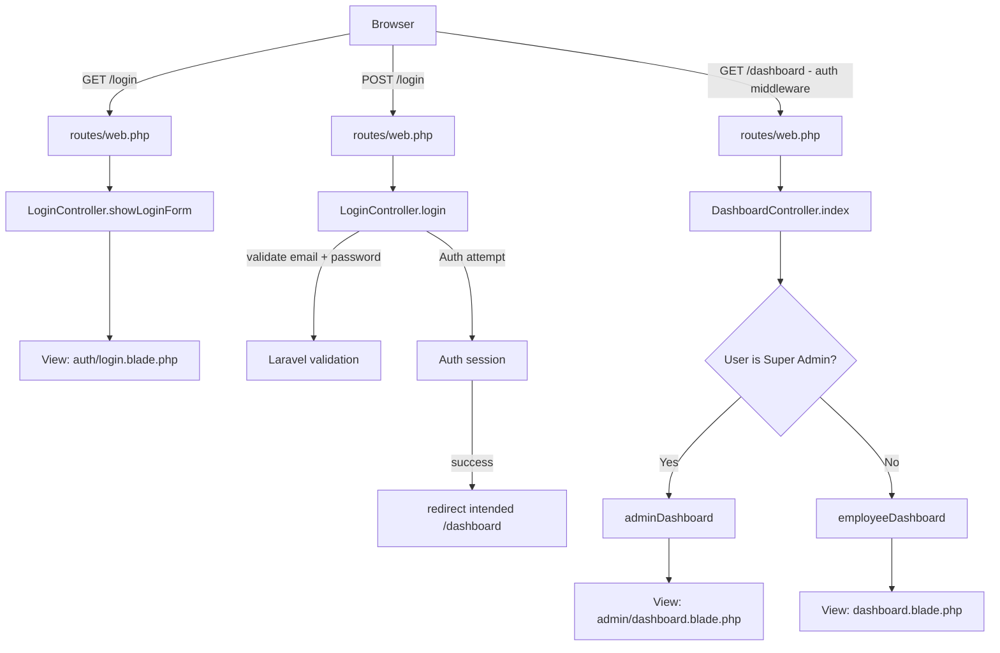
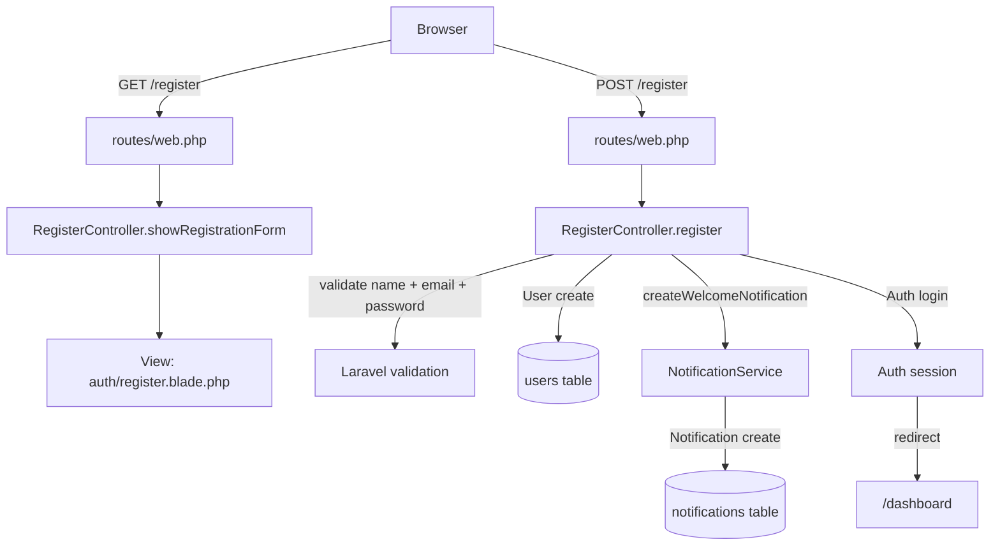
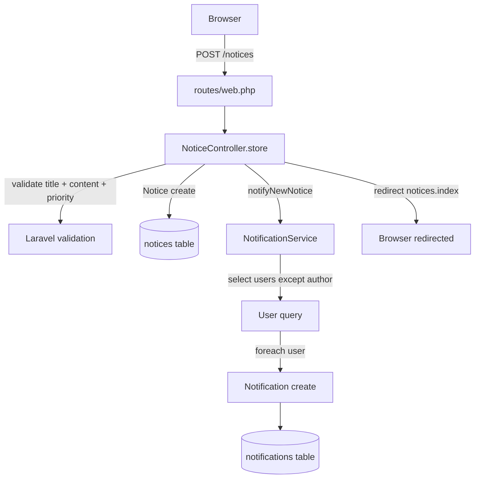
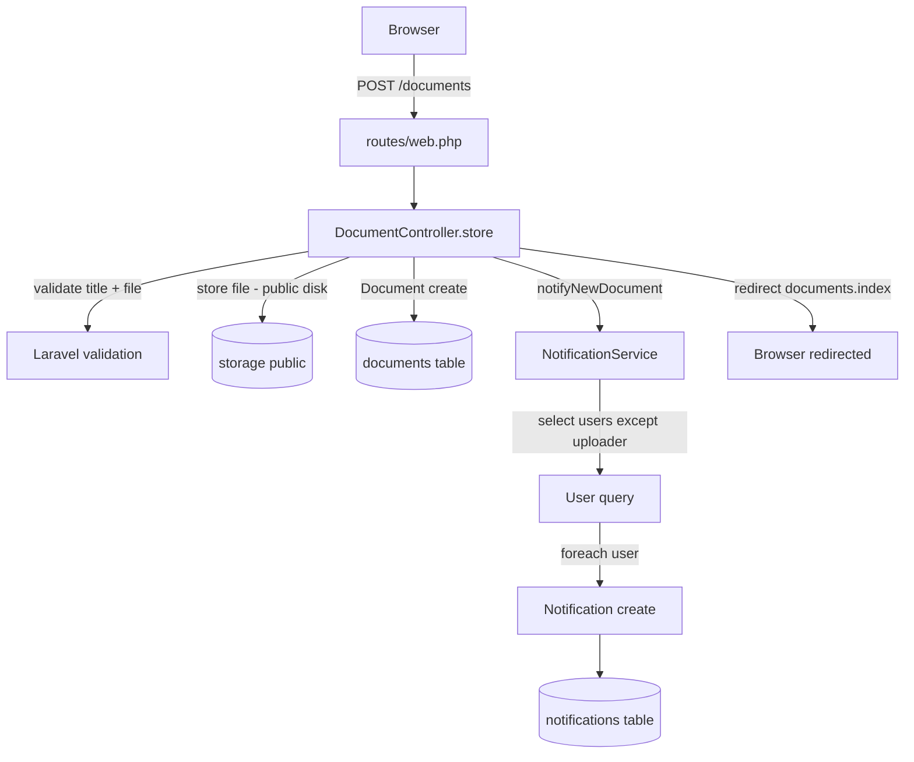
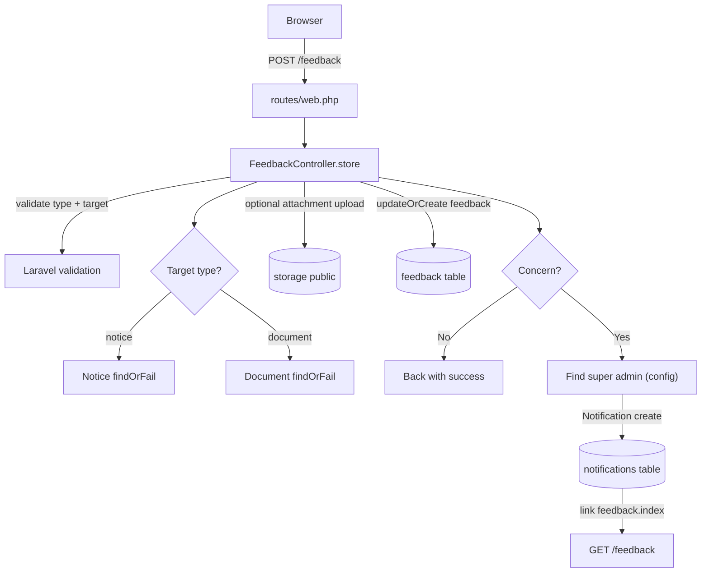
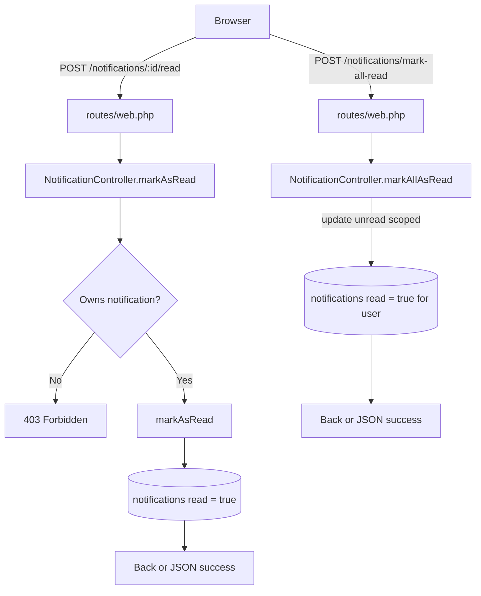
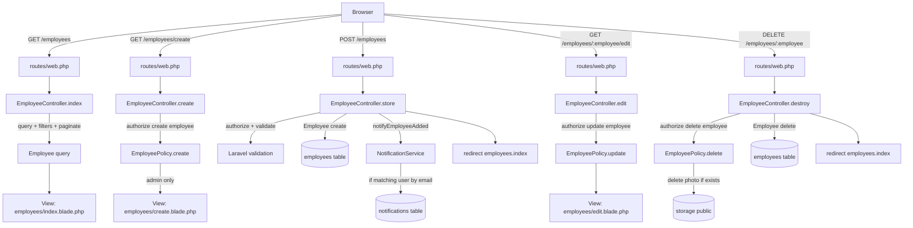
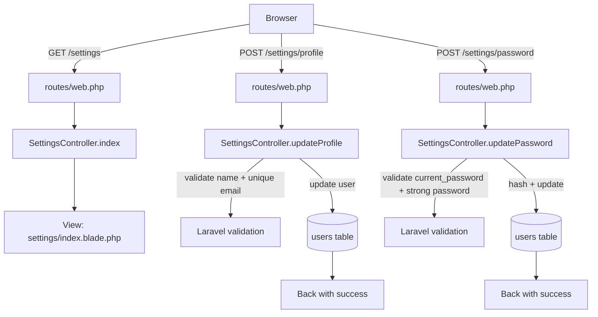

# TeamBoard Flow Maps

This document visualizes the key application flows (routes → controllers → models/services → views) and where the main business rules live.

> Notes
> - These are **Mermaid** diagrams. GitHub renders Mermaid in Markdown.
> - Routes: [routes/web.php](../routes/web.php)

---

## 1) Auth → Dashboard (role-based routing)

Key code:
- Auth controllers: [app/Http/Controllers/Auth/LoginController.php](../app/Http/Controllers/Auth/LoginController.php), [app/Http/Controllers/Auth/RegisterController.php](../app/Http/Controllers/Auth/RegisterController.php)
- Role rule: [app/Models/User.php](../app/Models/User.php)
- Dashboard branching: [app/Http/Controllers/DashboardController.php](../app/Http/Controllers/DashboardController.php)

---

## 2) Register → Welcome Notification

Key code:
- Register controller: [app/Http/Controllers/Auth/RegisterController.php](../app/Http/Controllers/Auth/RegisterController.php)
- Welcome notification: [app/Services/NotificationService.php](../app/Services/NotificationService.php)

---

## 3) Create Notice → Fan-out Notifications

Key code:
- Notice controller: [app/Http/Controllers/NoticeController.php](../app/Http/Controllers/NoticeController.php)
- Service: [app/Services/NotificationService.php](../app/Services/NotificationService.php)
- Models: [app/Models/Notice.php](../app/Models/Notice.php), [app/Models/Notification.php](../app/Models/Notification.php)

---

## 4) Upload Document → Fan-out Notifications

Key code:
- Document controller: [app/Http/Controllers/DocumentController.php](../app/Http/Controllers/DocumentController.php)
- Model helpers: [app/Models/Document.php](../app/Models/Document.php)

---

## 5) Feedback (Acknowledge/Disagree/Concern) → Concern notifies Super Admin

Key code:
- Controller: [app/Http/Controllers/FeedbackController.php](../app/Http/Controllers/FeedbackController.php)
- Models: [app/Models/Feedback.php](../app/Models/Feedback.php), [app/Models/Notice.php](../app/Models/Notice.php), [app/Models/Document.php](../app/Models/Document.php)

---

## 6) Notifications → Mark as Read / Mark All as Read (ownership enforced)

Key code:
- Controller: [app/Http/Controllers/NotificationController.php](../app/Http/Controllers/NotificationController.php)
- Model scope/helper: [app/Models/Notification.php](../app/Models/Notification.php)

---

## 7) Employees CRUD (Policy-based authorization)

Key code:
- Controller: [app/Http/Controllers/EmployeeController.php](../app/Http/Controllers/EmployeeController.php)
- Policy: [app/Policies/EmployeePolicy.php](../app/Policies/EmployeePolicy.php)
- Policy registration: [app/Providers/AuthServiceProvider.php](../app/Providers/AuthServiceProvider.php)

---

## 8) Settings (Profile + Password)

Key code:
- Controller: [app/Http/Controllers/SettingsController.php](../app/Http/Controllers/SettingsController.php)
- View: [resources/views/settings/index.blade.php](../resources/views/settings/index.blade.php)

---

## Source Index

- Routes: [routes/web.php](../routes/web.php)
- Controllers: [app/Http/Controllers](../app/Http/Controllers)
- Models: [app/Models](../app/Models)
- Policies: [app/Policies](../app/Policies)
- Notification service: [app/Services/NotificationService.php](../app/Services/NotificationService.php)
